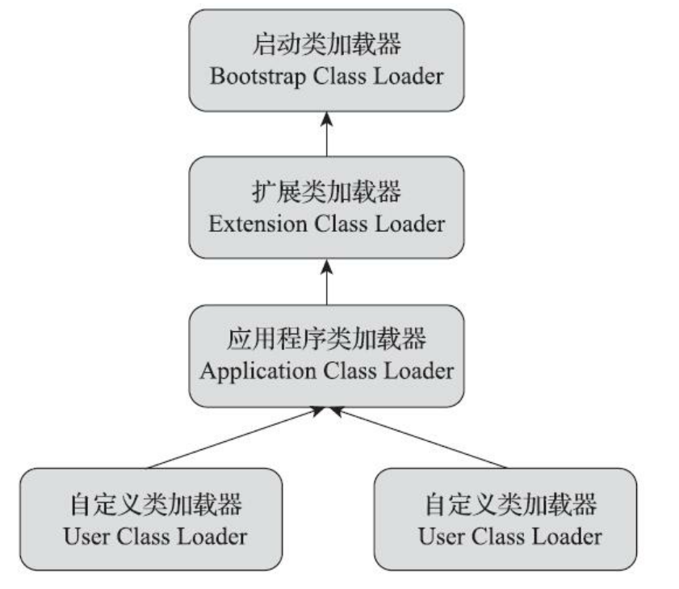
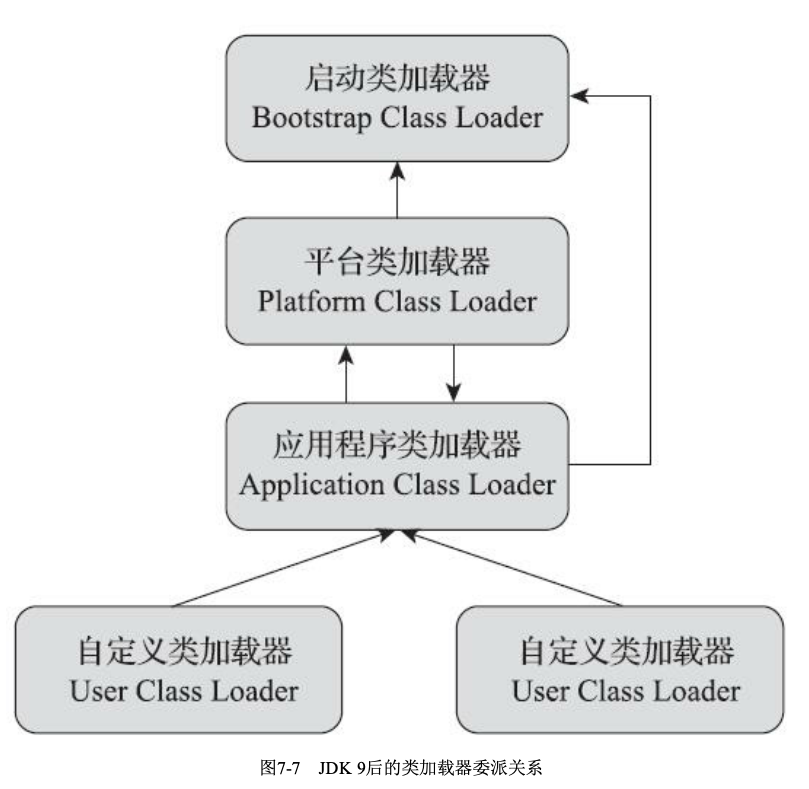

### 类加载过程  
    

### 初始化  

#### 有且只有以下6种情况（主动引用）必须立即对类进行'初始化'  

1. 遇到new，getstatic，putstatic，invokestatic这四条字节码指令  
    
    - 使用new关键字实例化对象  
    - 读取或设置一个static字段（除被final修饰的字段，因为它在编译时结果已经放到常量池中）  
    - 调用一个静态方法  
    
2. 使用java.lang.reflect包的方法对类进行反射，且还没有初始化过  
3. 在初始化一个类时，如果发现其父类还没有初始化，那么就需要先初始化其父类（对于接口有些许区别，在一个接口初始化时，并不要求
父接口全部初始化，只有在真正使用到父接口时<如引用接口中定义的常量>才会初始化     
4. JVM启动时会初始化包含main()方法的类  
5. 当使用JDK 7新加入的动态语言支持时，如果一个java.lang.invoke.MethodHandle实例最后的解析结果为
REF_getStatic、REF_putStatic、REF_invokeStatic、REF_newInvokeSpecial四种类型的方法句柄，并且
这个方法句柄对应的类没有进行过初始化，则需要先触发其初始化。  
6. jdk1.8+中使用接口中的默认方法（即被default修饰的接口方法），如果有这个接口的实现类发生了初始化，那该
接口要在其之前被初始化  

#### 典型不会触发初始化的被动引用  

1. 子类调用父类的静态属性，不会触发子类初始化（只会触发父类初始化）  
2. 定义一个类型数组，例如 `Person[] p = new Person[]` 并不会真正初始化Person类  
3. 调用一个类中被final修饰的常量，因为在编译时被写入常量池，常量化使用，所以不会初始化定义它的类  

### 加载  

1. 通过一个类的全限定名获取定义此类的二进制字节流  
2. 将这个字节流所代表的静态存储结构转换为方法区的运行时数据结构  
3. 在内存中生成一个代表这个累的java.lang.Class对象，作为方法区这个类的各种数据的访问入口  

### 连接  

#### 验证 

验证Class文件的字节流中包含的信息符合规范要求

- 文件格式验证：包括0xCAFEBABE开头，class文件和jvm版本匹配，常量池中常量类型检查....  
- 元数据验证：是否有父类，是否实现了父类或接口中的所有要求实现的方法，是否继承了不允许被继承的类...
- 字节码验证：主要是验证类的方法体（Code属性），保证被校验类的方法在运行时不会作出危害虚拟机安全的行为  
- 符号引用验证：主要就是验证该类是否缺少或者被禁止访问它依赖的某些外部类，方法，字段等资源，例如通过类的名字能否找到对应
的类，符号引用中类，字段，方法的可访问性是否被当前类访问...  

#### 准备  

为静态变量（被static修饰的变量）分配内存空间并设置**初始值**。1.7-分配在方法区中，1.8+分配在堆内存中。  
也就是过了这个阶段静态变量的值一般会被设置为此类型的初始值0，0L，false，null等。二般情况：如果静态对象同时还被final修饰，那么
在这个阶段是会被赋予用户设置的值。  

#### 解析  

把常量池内的符号引用替换为直接引用的过程  

- 符号引用：用一组符号来描述所引用的目标，有JVM无关性，只要能无歧义的定位到目标即可。引用的目标不一定是已经加载到JVM内存
中的内容。  
- 直接引用：直接指向目标的指针，相对偏移量或间接指针。和JVM直接相关，存在直接引用那么目标一定在JVM内存中已经存在  

#### 初始化  

在初始化阶段,JVM会根据程序员通过程序编码制定的主观计划去初始化变量和其他资源.或者说初始化阶段就是执行类构造器<clinit>()方法的过程.  

- <clinit>() 方法: 非程序员手动定义,由编译器自动收集类中的所有类变量的赋值动作和静态语句块(static{}块)中的语句合并产生的,编译器收集
的顺序是由语句在源文件中出现的顺序决定的,定义在它之后的变量,在前面的静态语句块可以赋值,但是不能访问.

### 类加载器  

#### 概览  

- 用来实现类的加载动作
- 从JVM视角可分为:启动类加载器(1.8-,BootstrapClassLoader,由C++编写,是JVM的一部分.1.9+,存在一个无法获取实例的BootstrapClassLoader类)和
其他类加载器(由Java编写)  
- 在JVM中每一个类都需由它的类加载器和类本身一起共同确定其唯一性.也就是不同的类加载器加载同一个类,加载进来的类是不同的,可用equal(),
instanceof来检验
- 可重写CLassLoader类中的loadCLass()方法来实现自己的类加载器  

#### 类加载器三层结构    
 
- 启动类加载器(BootstrapClassLoader):  

    - 负责加载存放在<JAVA_HOME>\lib中的类库,也就是最最最基础的一些类库  
    - 用户代码无法直接调用,某些实现使用null来代指  
    
- 拓展类加载器(ExtensionClassLoader):

    - 在类sun.misc.Launcher$ExtClassLoader中使用Java代码实现  
    - 负责加载<JAVA_HOME>\lib\ext目录中类库  
    
- 应用程序类加载器(ApplicationClass Loader):  

    - 在类sun.misc.Launcher$AppClassLoader中使用Java代码实现  
    - 可通过getSystemClassLoader()方法返回,又被称为"系统类加载器"  
    - 负责加载用户类路径上所有的类库,可直接在代码中使用这个类加载器.如果用户没有定义自己的类加载器,此加载器是程序默认的类加载器.

#### 双亲委派模型  

    

如果一个类加载器收到了类加载的请求,它首先不会自己去尝试加载这个类,而是把这个请求委派给父类加载器去完成,每一个层次的类加载器都是如此
,因此所有的加载请求最终都应该传输到最顶层的启动类加载器中,只有当父加载器反馈自己无法完成这个加载请求时,子类才会尝试自己去完成加载.  

- 优点: 实现了一种自带优先级的结构,可以保证加载类的一致性.比如如果用户自己定义了一个和rt.jar中重名的一个类,可以保证加载的时rt.jar中的
类而不是用户自定义的,保证了不同环境下类加载的一致性.  
- 注意: 非强制性约束模型  
- 打破:   
    1. 兼容1.2-的历史代码,添加findClass()方法  
    2. JNDI服务,使用线程上下文类加载器(ThreadContextClassLoader),做一个反向的委派,实现父类加载器请求子类加载器  
    3. OSGi动态热部署,使用自定义的类加载器  
    
### Java模块化系统,1.9+  

- 向下兼容,低版本jar包可在1.9+中无感运行  
- 不支持多版本共存,需要在编译时指定版本参数编译  
- 模块化下类加载器的变动  
    1. 第二层拓展类加载器(ExtensionClassLoader) 转换为 平台类加载器(PlatformClassLoader)
    2. 委派不再是从下往上依次依层级委派,在拓展类加载器和平台类加载器接收到加载指令时,会先检查该类是否属于某一个确定的模块,如果属于,会直接委派
    负责该模块的加载器去加载这个类
