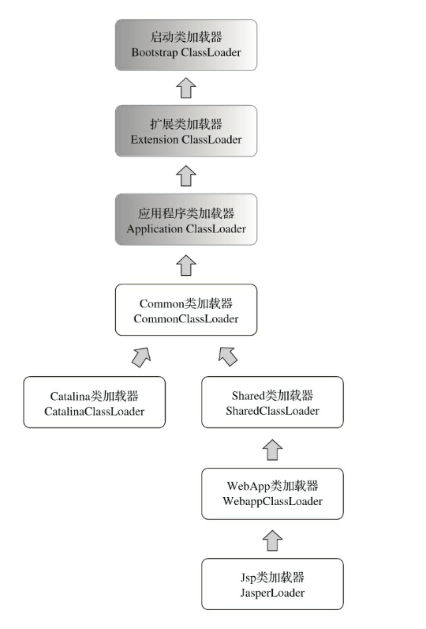

#### Tomcat  

- 类库隔离:自定义类加载器  
自定义类加载器同样使用双亲委派模型
    - Common类加载器: 加载/common/*,可以被Server和WebApp共享  
    - Catalina类加载器: 加载/server/*,可以被Server共享但是不和WebApp共享  
    - Shared类加载器: 加载/shared/*,可以在WebApp之间共享,但是不和Server共享  
    - WebApp类加载器: 加载/WebApp/WEB-INF/*,只在当前WebApp中共享,不和其他WebApp或Server共享  
    - Jsp类加载器: 加载当前WebApp项目下的JSP文件  

#### OSGi  

一个动态模块化规范,委派关系是在加载时才能确定的网状委派,基于各个模块的Bundle,使用Export和Import来确定各个依赖关系  

#### 字节码生成技术和动态代理实现  

- 关键是InvocationHandler和Proxy接口
- 是Spring中实现AOP的一种方式,另一种方式是CGlib
