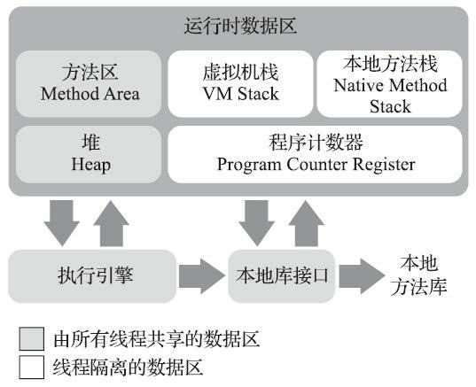

### JVM内存区域  
  

#### 线程私有

1. 程序计数器  
    - 用于标识程序下一步要执行的机器码的行号.线程私有.  
    - 在规范中唯一一块完全不可能发生OOM(OutOfMemoryError)的区域.  
    
2. Java虚拟机栈  
    - 描述Java方法执行的线程内存模型:每个方法被执行的时候,Java虚拟机都会同步创建一个栈帧.
    每个方法被调用直至执行完毕的过程,对应着一个栈帧在虚拟机栈中从入栈到出栈的过程.
    main()会首先被压入栈,如果main()方法出栈,程序执行完毕.  
    - 栈帧:存储局部变量表,操作数栈,动态连接,方法出口等.  
    - 日常口中所描述的栈即此栈(Java虚拟机栈),更进一步是指此栈中的局部变量表部分.  
    - 局部变量表存储: 8种基本数据类型,对象引用(只是一个地址,而不是本身),returnAddress.
    采用局部变量槽(Slot)实现,除了 long 和 double 这两个大萝卜各占两个坑,其他的一个萝卜一个坑.(这是在一个Slot32位的情况下).  
    - 两种异常:栈深度太深超过允许值(SOE,StackOverflowException);JVM空间不够了申请栈空间申请不到了(OOM,OutOfMemoryError)  
    
3. 本地方法栈  
    - 作用同虚拟机方法栈相似,只是这个为Native方法准备.  
    - 异常情况同Java虚拟机栈.  

---

#### 线程共有  

1. Java堆  
    - 存储:对象实例,字符串常量池(1.8+) (例:Person p = new Person() new出来的这个Person实体是存放在堆内的,而p是存放在虚拟机栈中的).  
    - 规范不要求连续,但逻辑上是连续的.  
    - 占用空间最大,垃圾回收最频繁.
    
2. 方法区  
    - 存储:类型信息,常量,静态变量,代码缓存.不再存储字符串常量池,转移到堆内(1.8+)
    - 存在垃圾回收机制,但是垃圾回收很少.
    - 存储空间满了之后,会出现OOM.  
    - 运行时常量池:  
    
        - 方法区的一部分.  
        - 存放:编译期生成的各种字面量和符号引用.(_猜想: 类中定义的被static修饰的静态成员,会在类加载时被存放在RCP中,
        所以也就只有一份,同时还被所有线程共享._)  

3. 直接内存(Native堆)
    - 并非JVM运行时数据区的一部分,利用Native方法直接在物理内存中划分出来的一部分,也可以被称为.  
    - 主要用于NIO,通过Java堆中的DirectByteBuffer对象作为指针.  
    - 由于物理内存限制,同样会出现OOM 

### 对象内存布局  

1. 对象头:
  
    - 存储对象自身的运行时数据:哈希码,GC分代年龄,锁状态标识,...  
    - 类型指针:指向类型元数据即Class  
    
2. 实例数据:  

    - 这一部分保存对象内定义的字段信息  
    - 存储有顺序,占用相同宽度的字段放在一起,父类字段在子类字段之前  
    
3. 对齐填充:  

    - 占位符,对象大小必须为8个字节的整数倍
