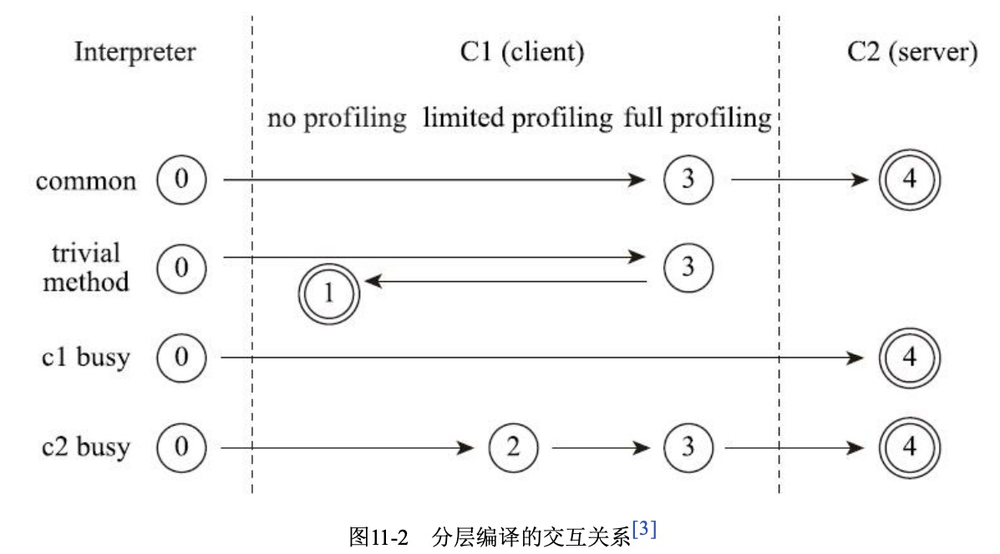

主流的两款商用Java虚拟机:HotSpot,OpenJ9  

程序编译执行的起点都是采用解释器进行解释执行,随着程序的不断运行,逐渐发现热点代码,然后即时编译器(JIT)把这一部分字节码编译成本地机器码,
在这个阶段编译器会大力优化代码.  

在激进优化的过程中可能会碰到"罕见陷阱"(即大部分情况下都能保证执行结果正确,但是在极少数情况下可能会出现异常情况),在这时编译器通过逆优化
把这一部分代码重新交给解释器使用解释执行,把解释器当作"逃生门".  

HotSpot虚拟机内置:客户端编译器(C1),服务端编译器(C2)和Graal编译器(1.10+,目的是代替C2)  

分层编译:
·第0层。程序纯解释执行，并且解释器不开启性能监控功能(Profiling)。 ·第1层。使用客户端编译器将字节码编译为本地代码来运行，进行简单可靠
的稳定优化，不开启
性能监控功能。  
·第2层。仍然使用客户端编译器执行，仅开启方法及回边次数统计等有限的性能监控功能。  
·第3层。仍然使用客户端编译器执行，开启全部性能监控，除了第2层的统计信息外，还会收集如 分支跳转、虚方法调用版本等全部的统计信息。  
·第4层。使用服务端编译器将字节码编译为本地代码，相比起客户端编译器，服务端编译器会启 用更多编译耗时更长的优化，还会根据性能监控信息进行
一些不可靠的激进优化。  

  

热点代码分为两类:  

- 被多次调用的方法:编译整个方法体  
- 被多次执行的循环体: 同样是编译整个方法体,但是采用"栈上替换"的方式进行  

主流热点探测方法:  

- 基于采样的热点探测:虚拟机周期性检查各个线程的调用栈顶,如果某个方法经常性的出现在栈顶,那么就可以判定它是'热点方法'.优点:简单高效;缺点:不精确  
- 基于计数器的热点探测:为每个方法或者代码块({...})建立计数器,统计方法的执行次数,超过阈值即可判定为热点方法.优点:足够精确;缺点:实现麻烦,
需要为每个方法建立和维护计数器  
