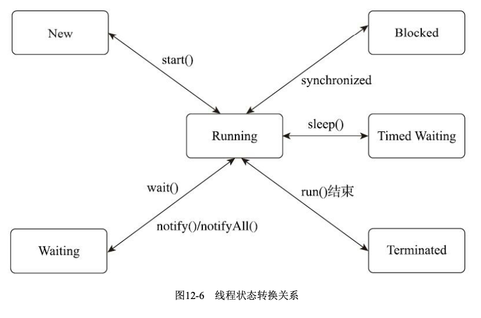

volatile关键字:  

在符合以下两条规则时可以使用:  

- 运算结果并不依赖变量的当前值,或者能够确保只有单一的线程修改变量的值  
- 变量不需要与其他的状态变量共同参与不变约束

适用场景:  

- 在多个线程中作为一个终止的flag,保证让所有的线程全部接收到这个flag的更新,停止工作

```java
volatile boolean shutdownRequested;
public void shutdown() { 
    shutdownRequested = true;
}
public void doWork() {
while (!shutdownRequested) {
// 代码的业务逻辑 }
}
```


线程安全性需要考虑先行发生原则                                                                                                                                          


线程实现:  

- 内核线程实现(1:1实现): 使用轻量级进程(LWP)对接内核线程(KLT),一个内核线程对应一个轻量级进程,一个进程可以拥有多个轻量级进程(LWP),
各个线程之间的调度由系统来完成  

    - 局限性: 基于内核线程实现,需要在用户态和内核态中来回切换,性能消耗会高一点.
    
- 用户线程实现(1:N实现): 线程的全过程都是在用户态完成,所有的线程操作都需要用户程序自己去处理.  

    - 优点: 不需要系统内核支援,性能很好,对于一些面向高并发的语言比如Golang采用用户线程实现.
    - 局限性: 没有系统内核支援,所有的线程操作都需要自己实现.某些操作很难实现,或者不可能实现,局限性更大一些.  
    
- 混合实现(N:M实现): 将内核线程和用户线程混合使用.兼顾上两者的优点,在UNIX系列的操作系统中提供M:N的线程模型实现.  

- Java实现: 1.2- 用户线程实现;1.3+ 内核线程实现(主流平台)  

线程调度:  

- Java内置10个线程优先级,Windows内置7个,不能一一对应  
- 设置线程优先级并不是一个稳定的调节手段,不能依赖于此  

状态转换:  

- 6种状态:新建(new),运行(runnable),无限期等待(waiting),限期等待(timed waiting),阻塞(blocked),结束(terminated)
- 转换关系图:
  


