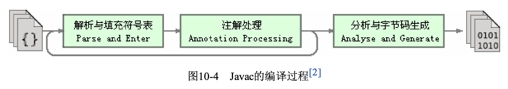

编译器分为三类:    

- 前端编译器:用于把 *.java(或其他语言编写的程序) 转换为 *.class  
- 即时编译器(JIT,Just In Time Compiler):在运行期间把字节码转换为本地机器码  
- 提前编译器(AOT,Ahead Of Time Compiler):直接把程序编译成与目标机器指令集相关的二进制代码

Javac编译过程:  

- 准备阶段: 初始化插入式注解处理器  
- 解析与填充符号表过程,包括:  
    
    - 词法,语法分析.将源码的字符流转换为标记集合,构造出抽象语法树  
    - 填充符号表.产生符号地址和符号信息  
    - 插入式注解处理器处理注解,(Lombok插件就是基于此实现)  
    - 分析与字节码生成过程

  

语法糖:  

foreach,泛型,lambda表达式...
